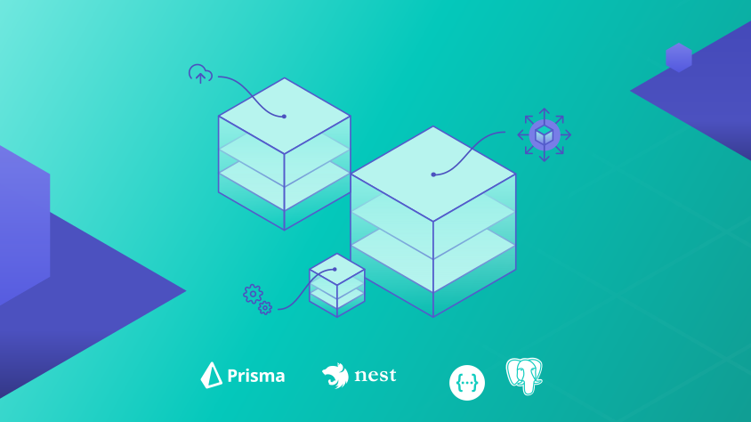

<p align="center">
  <a href="http://nestjs.com/" target="blank"></a>
</p>

[circleci-image]: https://img.shields.io/circleci/build/github/nestjs/nest/master?token=abc123def456
[circleci-url]: https://circleci.com/gh/nestjs/nest

<h1 align="center">
Sigtrans API Chalenge
</h1>
<p align="center">
  <a href="https://www.prisma.io/blog/nestjs-prisma-rest-api-7D056s1BmOL0
" target="blank"></a>
</p>


## Description

API desenvolvida para o processo de seleção da Sigtrans.

- Tecnologia: Node.js / Nest.js
- Linguagem programação: typescript
- Persistencia: DB Postgres / ORM Prisma
- Arquitetura: Foi aplicado principios do Clean Arch e do RESTFull
- Documentação: Endpoints expostos com swagger-ui


## Installation

```bash
$ npm install
```

## Docker

```bash
# create docker-compose file
$ touch docker-compose.yml


$ # docker-compose.yml
version: '3'

services:
pgsql:
image: postgres:alpine
ports: - '5433:5432'
container_name: 'pgsql'
restart: always
volumes: - pg-data:/var/lib/postgresql/data
environment:
POSTGRES_USER: pguser
POSTGRES_PASSWORD: pgpassword
volumes:
pg-data:

# run
$ docker-compose up
```

## Migrations
```bash 
$ npx prisma migrate dev
```
## Populate DB
- Popular o banco com dados iniciais
```bash 
$ npx prisma db seed
```
## Running the app

```bash
# development
$ npm run start

# watch mode
$ npm run start:dev

# production mode
$ npm run start:prod
```


## Swagger
```bash
# http://localhost:3000/api-docs
```
<p align="center">


</p>

## Support

Nest is an MIT-licensed open source project. It can grow thanks to the sponsors and support by the amazing backers. If you'd like to join them, please [read more here](https://docs.nestjs.com/support).

## Stay in touch

- Author - [Kamil Myśliwiec](https://kamilmysliwiec.com)
- Website - [https://nestjs.com](https://nestjs.com/)
- Twitter - [@nestframework](https://twitter.com/nestframework)

## License

Nest is [MIT licensed](LICENSE).
